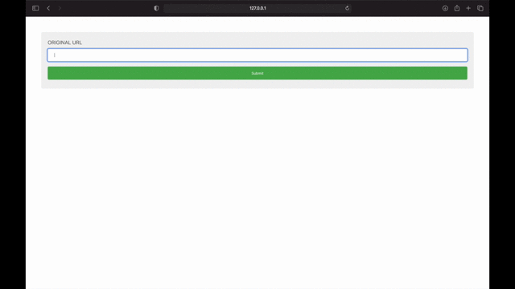

# Url-Shortner Using Flask.

This repo contains flask application that helps to shorten Urls given as input and also keep a count of number of visits done for these urls.

While practicing it helped me to learn basic flask structure, integration of db and also how url shortner, like tinyurl, may be designed.

# Libraries used :
## Stated in Requirements.txt
- Flask
- Flask-SQLAlchemy
- python-dotenv

# References :

* Tuitorial : https://youtu.be/rGQKHpjMn_M
* Flask Documentation : https://flask.palletsprojects.com/en/1.1.x/quickstart/
* System Design Tuitorial : https://youtu.be/JQDHz72OA3c
